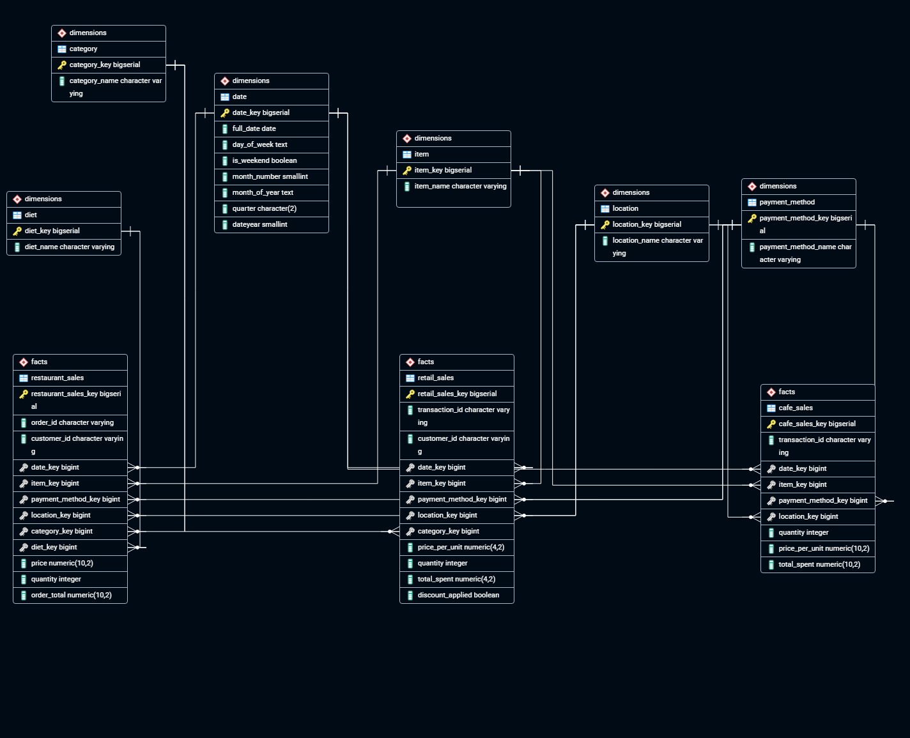

# Sales Data Infrastructure

A data migration and cleaning ETL infrastructure that extracts datasets from Kaggle, cleans and transforms them, and loads them into a PostgreSQL data warehouse modelled as a **fact constellation (galaxy schema)**: multiple fact tables sharing common conformed dimension tables. 
  

## Table of Contents 
- [Overview](#Overview)
- [Data Pipeline Flow](#Data-Pipeline-Flow)
- [Project Structure](#Project-Structure)
- [Pipelines](#`Pipelines/`)
- [Data Warehouse](#`Data_Warehouse/`)
- [Data Warehouse Entity Relationship Model Diagram](#Data_Warehouse_Diagram)
- [Data Model Notes](#Data_Model_Notes)
- [Supporting Folders](#Supporting_Folders)
- [Environment Configuration](#Environment-Configuration)
- [Use Cases](#Use-Cases)
- [Version History](#Version-history)


---


## Overview

This Project runs **three related pipelines**. Each pipeline extracts a distinct dataset from Kaggle, but the datasets are related to one another, even as records across pipelines are eventually linked via **composite keys**, which is what allows fact tables to share dimensions in the warehouse.   

--- 

## Data-Pipeline-Flow

Each of the three pipelines follows the same four steps:
```
1. Config     -> Configures the data pipelines and database 
2. Extract    -> Authenticates & pulls datasets via Kaggle API, saves raw .csv file(s) to disk (datasets/) and loads csv into DataFrame (Pandas)
3. Transform  -> Clean, validates, and reshapes the data (handle missing values, fix schema/type issues, enforce composite key integrity, deduplicate, etc.)
4. Load       -> Write cleaned Dataframe into PostgreSQL data warehouse (fact/dimensions tables)  
```

---
## Project-Structure

| Folder | Purpose | When to Use |
| ------ | ------- | ----------- |
| **data_warehouse/** | PostgreSQL database modelled as a fact constellation/star cluster: multiple fact tables share common dimension tables | Database setup, schema changes, understanding warehouse architecture |
| **datasets/** *(gitignored)* | Raw and intermediate CSV files downloaded from Kaggle | Local staging area between Extract (including Download, Read) & Transform sequence |
| **pipeline/** | The three ETL pipelines, each in its own subfolder | Running, modifying, or debugging extract/transform/load logic |
| **sales_data_logs/** | Logs for both database operations and pipeline runs | Monitoring runs, debugging failures, auditing loads |
| **tests/** | Unit and integration tests for pipelines and the database | Validating pipeline correctness before/after changes, CI/CD |
| **config/** *(gitignored)* | `.env` files: Kaggle API credentials, PostgreSQL connection strings, other secrets | Configuring environment-specific settings |
| **sales_data_notebooks/** | Jupyter notebooks documenting exploratory data analysis and the reasoning behind each cleaning/transform step | Understanding data quality issues, prototyping and justifying transformations |

---

## `Pipelines/` 
**(Detailed Structure)**
 
Each of the three pipelines is isolated in its own subfolder, with internal subfolders mirroring the ETL stages so extract, transform, and load logics stay decoupled and independently testable.
 
```
pipeline/
├── cafe_sales_pipeline/
│   └── cafe_sales_pipeline_sequence/                  
│       ├── config_cafe_sales/       # Sets up configuration for pipeline and database 
│       ├── extract_cafe_sales/      # Kaggle API auth + dataset extraction, Persist raw CSV to datasets/ & reads CSV → DataFrame
│       ├── transform_cafe_sales     # Cleaning & transformation logic   
│       └── load_cafe_sales/         # DataFrame → PostgreSQL
├── restaurant_sales_pipeline/
│   └── restaurant_sales_pipeline_sequence/
│       ├── config_restaurant_sales/
│       ├── extract_restaurant_sales/
│       ├── transform_restaurant_sales/
│       └── load_restaurant_sales/
└── retail_stores_sales_pipeline/
    └── retail_stores_pipeline_sequence/
        ├── config_retail_sales/
        ├── extract_retail_sales/
        ├── transform_retail_sales/
        └── load_retail_sales/

```
 
---
 
## `Data_Warehouse/` 
**(Detailed Structure)**
 
| Folder | Purpose | When to Use |
| ------ | ------- | ----------- |
| **diagrams/** | Visual database diagrams (ER model/ fact constellation diagram) | Understanding relationships and architecture |
| **schema/** | SQL table definitions and indexes for fact and dimension tables | Initial database setup |
| **migrations/** | Version-controlled schema changes | Updating existing databases |
| **security/** | Roles, permissions, RLS policies | Access control configuration |
| **scripts/** | Maintenance and utility scripts | Ongoing operations and monitoring |

---

### Data_Warehouse_Diagram



*[View full-size diagram](data_warehouse/diagrams/sales_data_warehouse_highconstrast_ermd.png)

---
### Data_Model_Notes
 
- **Schema type:** Fact constellation/galaxy schema — chosen because the three pipelines produce multiple fact tables that share common conformed dimension tables (rather than each fact table owning its own isolated set of dimensions, as in a simple star schema).
- **Composite keys:** Records across the three source datasets relate to one another through composite keys. These keys are preserved and validated through the `transform/` stage of each pipeline so that referential integrity holds once data lands in the shared dimension tables.
- **Data cleaning as migration:** Since the source data contains errors and omissions, loading is not a simple copy; it is a migration that resolves data quality issues (missing values, invalid types, duplicate or broken keys) before data is considered fit for the warehouse.
---
 
## Supporting_Folders
 
- **`sales_data_notebooks/`** — Each notebook corresponds to a pipeline (or a specific dataset) and walk through: initial data exploration → data quality issues found → the effect of each cleaning/transformation step, before that logic is finalized into `pipeline/*/transform/`.
- **`tests/`** — covers both pipeline logic (extract/read/transform/load steps) and database integrity (constraints, composite key relationships, fact-to-dimension joins).
- **`sales_data_logs/`** — separates pipeline execution logs from database logs (e.g `sales_data_logs/cafe_sales_pipeline.log/` and `sales_data_logs/database/`) to make debugging failures faster.
- **`config/`** — Stores separate `.env` files for the data pipeline. The folder is gitignored by design.
---
 
## Environment-Configuration
 
`.env` file(s) under `config/` includes, among other credentials, the following:
 
```
KAGGLE_USERNAME=
KAGGLE_KEY=
 
POSTGRES_HOST=
POSTGRES_PORT=
POSTGRES_DB=
POSTGRES_USER=
POSTGRES_PASSWORD=
```
 


---

## Use-Cases
 
| Role | How this project helps |
| ---- | ----------------------- |
| **Data Scientist** | The cleaning pipeline ensures downstream datasets have no unexpected missing data, giving a reliable foundation for modelling. |
| **Data Engineer** | The ETL pipelines move heterogeneous source data into a single source of truth (the PostgreSQL warehouse), handling extraction, transformation, and loading end-to-end. |
| **Data Analyst** | The pipeline delivers pre-cleaned, integrated data, ready for downstream reporting and analysis without needing to repeat cleaning work. |
 
---


## Version-history
```
1.1.0 - August 2026
```

---


